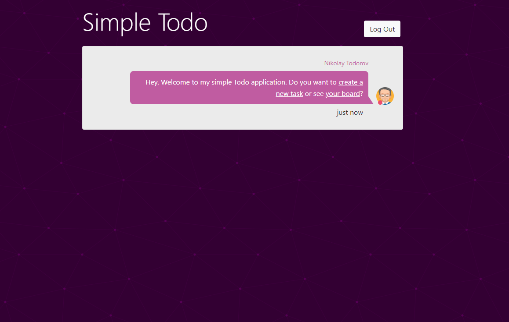
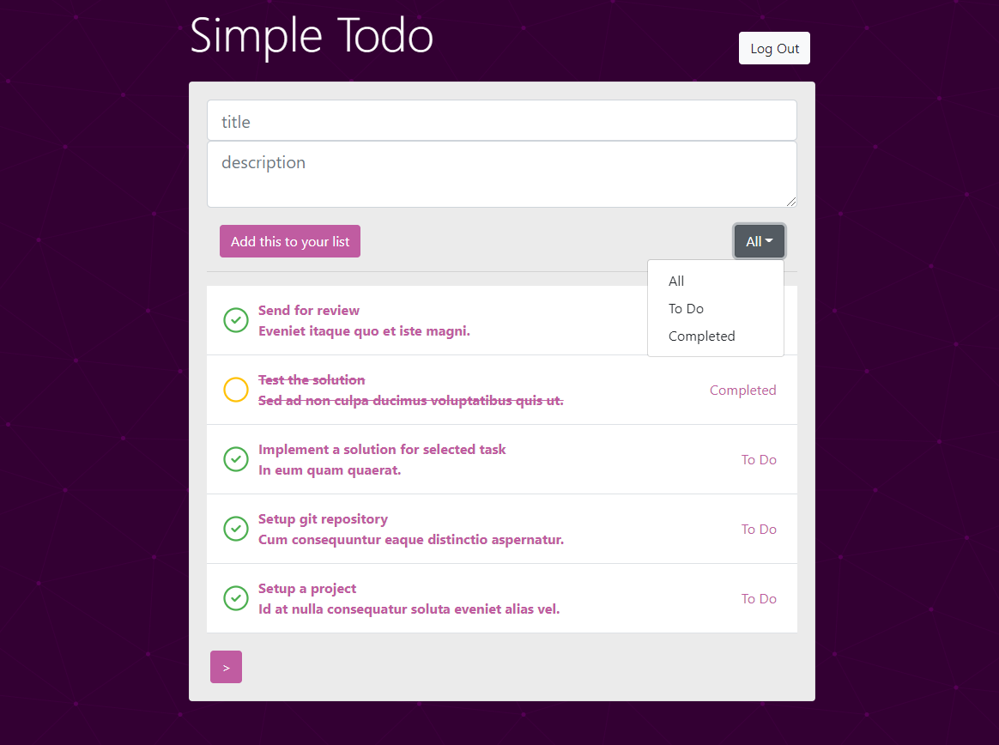

# Simple ToDo application
Simple ToDo application build with Laravel and VueJs for interview purposes demonstrating different techniques and approaches in PHP development.
It aims to provide the basic functionality for:

- creation of Todo items
- filtering of Todo items by status
- pagination of Todo items
- register/login users
- changing status of a given Todo item




## System Requirements

- PHP 7.4.*
- MySQL 8+ 
- node 14.15.*

## Project Setup

- Create a local database and configure virtual hosts for the  project.
- Execute the following commands in project root directory:

```
$ composer update
$ cp .env.example .env
```

- In the .env file you need to change the database settings, according to your configuration.
- Generate application key using the following command:

```
php artisan key:generate
```

- Execute the migrations:

```bash
php artisan migrate
```
- Execute the seeders to fill the database with some predefined records:

```bash
php artisan db:seed
```

- Install front-end dependencies:

```bash
npm install
```
- Build front-end javascript

```bash
npm run prod
```
- Run dev server or setup your server with php & node or use docker

```bash
php artisan serve
```
## Areas of Improvements
- Consider the use of Sanctum authentication or Laravel Passport
- Separate front-end component to multiple child components that interacts together
- Move front-end files into separate project

## Credits
- Laravel
- VueJs
